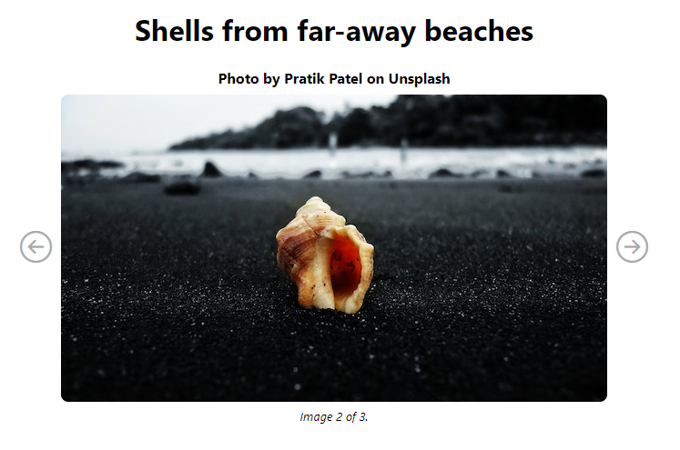

# React Testing Exercise
In this exercise, I practiced testing with React Testing Library. I was given a simple app with some bugs. I wrote tests to debug the app, and then fixed the bugs. I practiced Smoke tests, Snapshot tests, and Specialized tests with event handlers.

     

